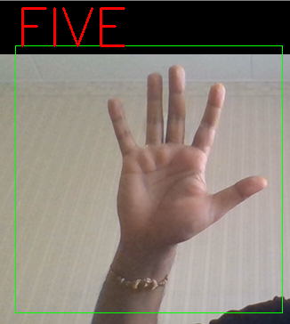
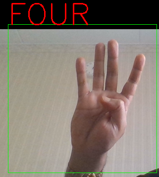
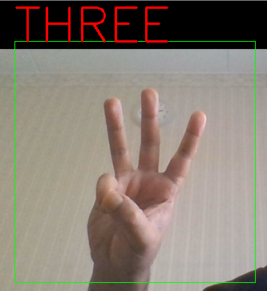
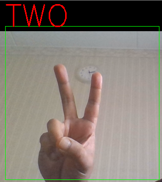
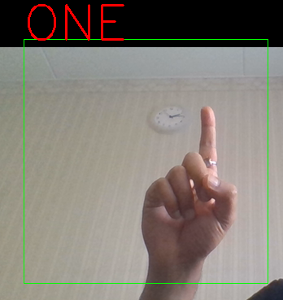
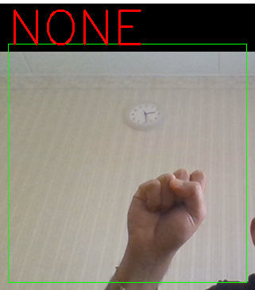

# FingerCount-CNN

FingerCount_CNN.ipynb -- code for training and creating .h5 model file 
FingerCountWebcam.ipynb -- code for using model file to detect finger count using webcam 
images-- training and validation images 

# Test Outputs

